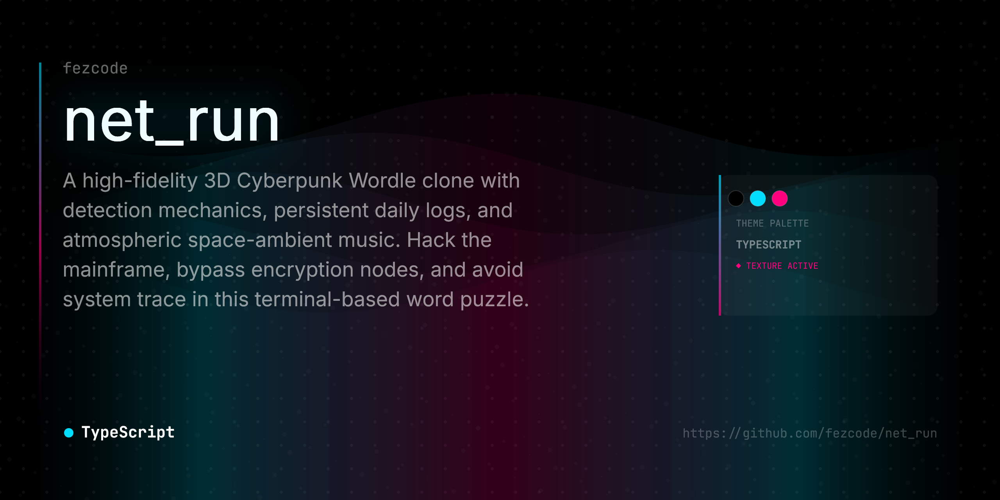

# 📟 NET_RUN | BYPASS INTERFACE



> **"High-tech, low-life word hacking."**

`NET_RUN` is a high-fidelity 3D Cyberpunk Wordle clone built with **React**, **Three.js**, and **React Three Fiber**. Unlike traditional word puzzles, you are an operative attempting to bypass secure encryption nodes. Every wrong letter increases your **Detection Risk**—hit 100%, and the connection is terminated.

---

## ⚡ system_features

-   **3D Hacking Environment**: A fully immersive terminal space with wobbling neon node cubes and a floating grid.
-   **Daily Sequence**: A unique encryption key every 24 hours (UTC), synced for all operatives globally.
-   **Detection Mechanics**: Every incorrect letter submission increases your trace risk.
-   **Practice Mode**: Re-run the interface with randomized sequences to sharpen your skills.
-   **Hack Logs**: Automatic persistence of your daily performance with a downloadable 2D matrix PNG share feature.
-   **Atmospheric Audio**: Randomized space-ambient playlist and haptic typing sensors (customizable in options).
-   **Visual Polish**: Advanced post-processing including Bloom, Chromatic Aberration, and Glitch effects on failure.

## 🛠 tech_stack

-   **Framework**: [React 19](https://react.dev/)
-   **3D Engine**: [Three.js](https://threejs.org/) via [@react-three/fiber](https://github.com/pmndrs/react-three-fiber)
-   **State**: [Zustand](https://github.com/pmndrs/zustand) + Persist Middleware
-   **Styling**: [Tailwind CSS v4](https://tailwindcss.com/)
-   **Post-Processing**: [@react-three/postprocessing](https://github.com/pmndrs/react-postprocessing)
-   **Animation**: [Framer Motion](https://www.framer.com/motion/)

## 🚀 deployment_protocol

### initiation
```bash
# clone the repository
git clone https://github.com/yourusername/netrun.git

# enter the terminal
cd netrun

# install dependencies
npm install --legacy-peer-deps

# boot the local instance
npm run dev
```

### build_&_deploy
```bash
# generate production build
npm run build

# deploy to github pages
npm run deploy
```

---

## 🎮 how_to_play

1.  **Input**: Type using your physical keyboard or the on-screen virtual interface.
2.  **Submit**: Press `ENTER` to attempt a bypass once 5 letters are entered.
3.  **Analyze**:
    -   🟢 **Green**: Correct letter, correct node.
    -   🟡 **Yellow**: Correct letter, wrong node.
    -   ⚪ **Gray**: Letter does not exist in the sequence.
4.  **Risk**: Watch the **Detection Meter**. Too many wrong letters will trigger a system lockout.
5.  **Trace**: You have 5 minutes before the security trace completes.

---

## 📜 credits

-   **Music**: 
    -   *Space Ambient* by Владислав Заворин
    -   *Space* by Dmitrii Kolesnikov
-   **Interface**: Developed by [fezcode.com](https://fezcode.com)

---

> **WARNING**: Unauthorized access to secure nodes is a violation of the Neo-Tokyo Data Act. Play at your own risk.
